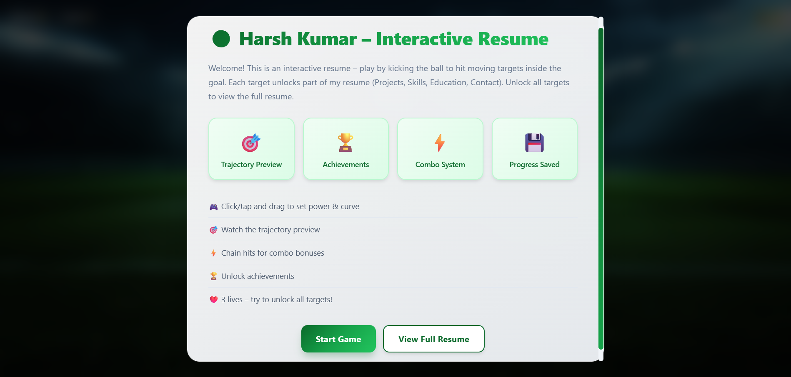
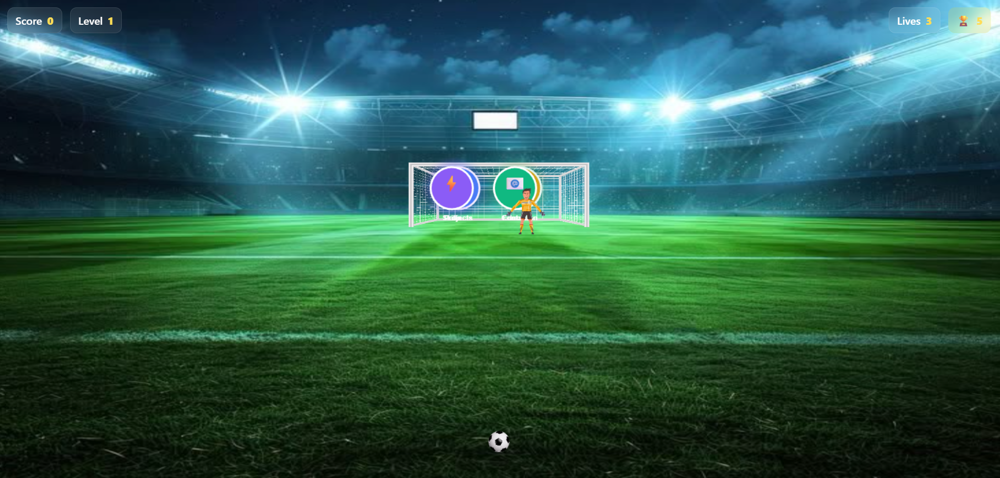
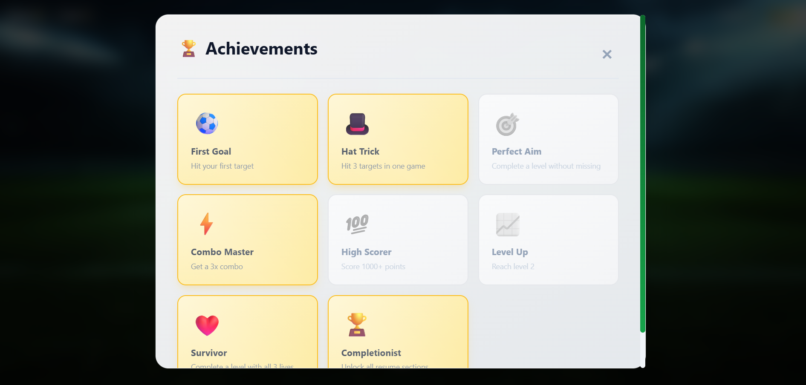

# ⚽ Interactive Resume - Harsh Kumar

> A football-themed gamified resume where you kick the ball to unlock my professional profile.

**[Play Live Demo](https://harsharma07-git.github.io/interactive-resume/)**

## About

This isn't your typical resume - it's an interactive game! Kick the football to hit moving targets and unlock different sections of my resume. Built with vanilla JavaScript to showcase creativity and technical skills.

## 🎮 Features
- Circular targets with glow effects
- Combo system for bonus points
- Achievement system
- Progress saving
- Mobile responsive

## 🛠️ Tech Stack

- **HTML5 Canvas** - Game rendering
- **CSS3** - Modern animations and responsive design
- **Vanilla JavaScript** - No frameworks, pure JS
- **LocalStorage API** - Progress persistence

## 🥅 How to Play

1. Click and drag to aim (dotted line shows trajectory)
2. Release to shoot the ball
3. Hit the circular targets to unlock resume sections
4. Avoid the goalkeeper!
5. Chain hits within 3 seconds for combo bonuses

**Target Sections:** 💼 Projects • ⚡ Skills • 🎓 Education • 📧 Contact

## 📸 Screenshots

### Start Screen

*Welcome screen with game features*

### Gameplay

*Active gameplay with trajectory preview and HUD*

### Achievements

*Achievement panel showing unlocked badges*

## 📧 Author
- GitHub:**https://github.com/harsharma07-git**
- LinkedIn:**https://www.linkedin.com/in/harsh-kumar-3882742a5**